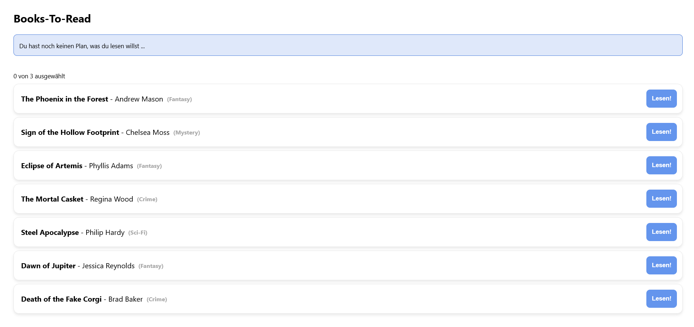

# React-Essentials - Aufgabe

Als Übung soll eine kleine App gebaut werden, mit der man Bücher auswählen kann, die man sich als nächstes Lese-Ziel setzen möchte.

### Aufgabe

*Beispiel:*

#### Bücherliste
- Die App soll eine Liste an auswählbaren Büchern anzeigen
- Für jedes Buch gibt es hierfür einen Eintrag mit Titel, Autor, Genre und einem "Lesen"-Button (Eintrag als wiederverwendbare Komponente bauen)
- Über den Button kann das entsprechende Buch ausgewählt bzw. wieder abgewählt werden
- Über der Liste zeigt ein kleiner Info-Text die Anzahl an ausgewählten und maximal auswählbaren Büchern an (z.B. "1 von 3 ausgewählt")
- Wurde das Maximum an auswählbaren Büchern erreicht, sollen alle "Lesen"-Buttons disabled werden - Abwählen eines Buches ist aber weiterhin möglich

#### Info-Box
- In einer Info-Box über der Bücherliste werden die ausgewählten Bücher angezeigt
- Wurde noch nichts ausgewählt, soll in der Info-Box ein entsprechender Text darauf hinweisen

*Beispiel mit maximaler Auswahl*

### Übungs-Projekt

Das Initial-Projekt ist bereits aufgesetzt; die Dependencies können mit `npm install` im "1-react-essentials/aufgabe" Ordner installiert werden und das Projekt kann dann mit `npm run dev` gestartet werden.

In der "App" Komponente befinden sich zwei TODOs und markieren die Stellen an denen die Buchauswahl und -liste angezeigt werden sollen.
Eine Liste mit verfügbaren Büchern ist bereits zur Verfügung gestellt.

In der "App.scss"-Datei befinden sich auch Styling-Klassen, welche genutzt werden können. Die Nutzung ist aber optional!

